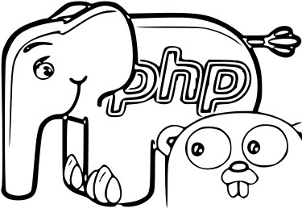
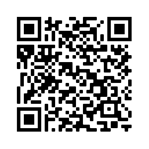

# Binary Search Trees in PHP & Go

The idea of this project is to show two binary search tree implementations side by side in two different languages.
What's the purpose of doing the same thing in two different languages? In think there
are two good reasons:

1. I get to learn more about each of the two languages through comparing them
2. Solving the same problem in two different languages gave me a better understanding of the problem and its solution in
   a language-independent way

The first BST implementation is in PHP and the second one in Go. If you're on a device with a large screen you'll be
able to see the code for both languages side by side and scroll through each of them
independently of the other. Please check out the mobile version of the site too by scanning the QR code below with your
phone's camera app. I think I came up with a pretty fun way to make up for the diminished screen real estate.

You'll see that the two BST implementations look very similar. The key differences between them are explained by fundamental paradigm differences
between the languages:
- First and foremost: Go is strongly, statically typed. PHP on the other hand is a dynamic and
  weakly typed language. As a result, in Go types must be specified and a variable cannot be assigned and the type of a
  variable cannot be changed after assignment. In PHP there are no (mandatory) type annotations and the type of a variable
  *can* be changed.
- The next big difference between the two languages is that PHP is object-capable, whereas Go is not. For our purposes, this boils down to the
  following: where in PHP we can use classes, in Go we have to use structs.
  And where in PHP we define class instance methods inside the class definition, in Go we define functions with a receiver
  of the struct (or pointer to the struct) outside of the struct definition. Additionally, PHP allows us to use the magic 'this'
  keyword to refer to the current object. Go has no such keyword.
- The last main difference is that Go has pointers and PHP does not. The implications of this are that in Go we have to
  think about whether in a given situation we need value or reference. In PHP we don't have to worry about anything
  like that. For instance, in methods you'll see receivers of type pointer to a tree, we want to modify the value that the receiver
  points to, rather than just a copy of it.

Link to project:

<a href="" target="_blank">https://binary-search-tree-in-php-and-go.onrender.com </a>

