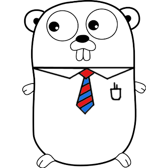

# My Resume/CV API

This is an API written in Go using the Gin web framework. The API gets my resume (stored as JSON in a MongoDB instance) and returns it to the user, either in full or by section. If you access the website at the root directory it will  return a JSON object containing all the resume data. If you go to "/resume.html" you get to see my resume as an HTML document. You can also get a certain section of a resume by accessing "/{{section}}". For instance, you can get a JSON object containing only the technologies via a GET request to "/technologies". The resume JSON in the database can also be updated via PUT request to the root directory. However, I have protected this with a token so that I'm the only one who can update it.

<h5>Link to project
</h5>
<a href="https://hidden-earth-88623.herokuapp.com/" target="_blank">https://hidden-earth-88623.herokuapp.com/</a>
<h5>Code walkthrough</h5>
<a href="https://kevinluxdev.blogspot.com/2022/01/my-resume-api.html" target="_blank">Code walkthrough</a>
